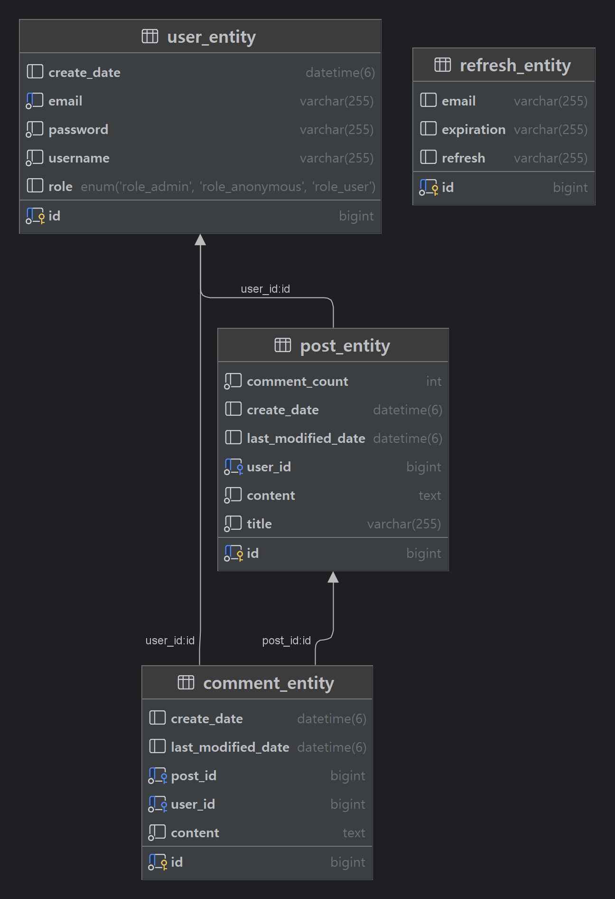

# 🗒 게시판 서비스

간단히 사용자들과 소통할 수 있는 게시판 서비스입니다. 이 서비스는 사용자가 게시글을 작성하고, 다른 사용자의 글에 댓글을 달 수 있는 기능을 제공합니다. 또한, 관리자는 부적절한 게시글과 댓글을 삭제하는 등의 관리 기능을 수행할 수 있습니다.

## 프로젝트 기능 및 설계

#### 1. **회원가입 기능**
- **일반 사용자**: 회원가입 시 `USER` 권한을 가집니다. 사용자는 회원가입 후 게시글과 댓글을 작성할 수 있습니다.
- **관리자**: `ADMIN` 권한을 가지며, 게시글과 댓글의 삭제 등 관리 기능을 수행할 수 있습니다.
- **아이디(Email) 중복 검사**: 회원가입 시 입력한 아이디(Email)는 고유해야 하며, 중복된 아이디는 허용되지 않습니다.

#### 2. **로그인 기능**
- **로그인**: 사용자는 회원가입 시 입력한 아이디(Email)와 비밀번호로 로그인을 할 수 있습니다.
- **JWT 토큰 발급**: 로그인 후, JWT 토큰(Access, Refresh)이 발급되어 인증이 필요한 요청에 사용됩니다.
- **토큰 재발급**: Access 토큰이 만료되면 Refresh 토큰을 통해 새로운 Access 토큰을 재발급받을 수 있습니다.

#### 3. **게시글 기능**
- **게시글 작성**: 로그인한 사용자는 권한에 관계없이 게시글을 작성할 수 있으며, 제목과 내용은 필수입니다.
- **게시글 수정**: 사용자는 자신이 작성한 게시글을 수정할 수 있으며, 수정된 시간은 기록됩니다.
- **게시글 목록 조회**: 모든 사용자는 게시글 목록을 조회할 수 있습니다. 게시글은 기본적으로 최신순으로 정렬되며, 댓글 수에 따라 많은 순/적은 순으로 정렬이 가능합니다. 페이징 처리도 적용됩니다.
- **검색 기능**: 제목과 내용에 포함된 키워드로 게시글을 검색할 수 있습니다.
- **정렬 기능**: 최신순, 댓글 수 등 다양한 기준으로 게시글을 정렬할 수 있습니다.
- **특정 게시글 조회**: 모든 사용자는 특정 게시글의 제목, 내용, 작성자 정보, 작성일을 확인할 수 있습니다.
- **게시글 삭제**: 관리자는 부적절한 게시글을 삭제할 수 있으며, 작성자는 자신의 게시글을 삭제할 수 있습니다.

#### 4. **댓글 기능**
- **댓글 작성**: 로그인한 사용자는 게시글에 댓글을 작성할 수 있으며, 댓글은 해당 게시글에 연결됩니다.
- **댓글 목록 조회**: 특정 게시글에 작성된 댓글 목록은 별도의 API로 조회됩니다. 댓글은 최신순으로 정렬되며, 페이징 처리가 적용됩니다.
- **댓글 삭제**: 관리자는 부적절한 댓글을 삭제할 수 있으며, 댓글 작성자는 자신이 작성한 댓글을 삭제할 수 있습니다.

#### 5. **보안 기능**
- **권한 관리**: 게시글 작성, 수정, 삭제와 댓글 작성, 삭제 등 모든 기능은 권한에 따라 허용됩니다. 일반 사용자는 자신의 게시글 및 댓글만 수정/삭제할 수 있으며, 관리자는 모든 게시글과 댓글을 관리할 수 있습니다.
- **JWT 토큰 인증**: 로그인한 사용자는 JWT 토큰을 통해 인증되며, 이를 기반으로 권한에 따른 접근이 결정됩니다.
- **경로별 인가 설정**: URL 경로마다 접근 권한이 세분화되어 설정되며, 사용자 권한(USER, ADMIN)에 따라 접근이 제한됩니다.

#### 6. **추가된 기능 및 기술**
- **Querydsl을 통한 검색 기능**: Querydsl을 사용해 동적 검색을 제공합니다. 제목과 내용에 포함된 검색어로 게시글을 필터링할 수 있으며, 검색과 동시에 페이징 및 정렬이 적용됩니다.
- **페이징 및 정렬**: 게시글과 댓글 모두 최신순 및 댓글 수, 특정 기준에 따라 정렬 가능하며, 많은 데이터를 처리할 때는 페이징 처리로 성능을 최적화합니다.
- **토큰 재발급 기능**: Refresh 토큰을 이용해 만료된 Access 토큰을 재발급받을 수 있습니다.

## 사용 기술 스택
- **Spring Boot**: 백엔드 애플리케이션 개발을 위한 주요 프레임워크.
- **Spring Security**: 인증 및 권한 관리를 위한 보안 프레임워크.
- **JWT (JSON Web Token)**: 로그인 인증 후, 토큰을 이용한 권한 인증 처리.
- **JPA (Java Persistence API)**: 게시글 및 댓글의 데이터베이스 처리.
- **Querydsl**: 복잡한 쿼리 및 동적 검색 기능을 위한 쿼리 빌더.
- **MySQL**: 관계형 데이터베이스로 게시글, 댓글, 사용자 데이터를 관리.
- **Lombok**: 반복되는 코드 생성을 줄이기 위한 편리한 애너테이션 제공.
- **JUnit 5**: 테스트 프레임워크로 단위 테스트를 지원

## 결론
이 프로젝트는 **사용자 간의 상호작용**을 위한 게시판 기능을 충실히 구현하였으며, **보안** 및 **권한 관리**, **검색과 페이징** 등 확장된 기능을 제공합니다. 또한, 관리자와 사용자의 **권한에 따른 차별화된 기능**이 적용되어 있어 효율적인 관리와 게시판 운영이 가능합니다.

## ERD 

### Tech Stack

 

### Trouble Shooting
[go to the trouble shooting section](doc/TROUBLE_SHOOTING.md)
